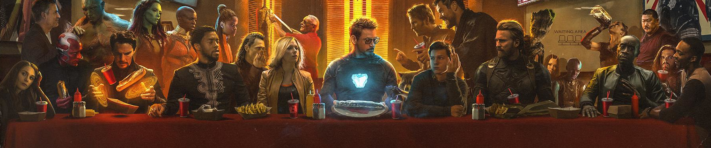

# 

<h1>Marvel Comics</h1>

<h3>Proyecto para aplicar los conocimientos adquiridos en el Lenio Bootcamp 2021</h3>

 

Elememntos que debe tener el proyecto:

<ul>
  <li> Las peticiones se tienen que realizar a la siguiente URL: 
  http://gateway.marvel.com/v1/</li>
  <li>El buscador tiene que tener la posibilidad de buscar los nombres de los Personajes de Marvel en el input pero también por URL.
  </li>
  <li>Cuando se entra la primera vez en la app web sin ningún personaje en la URL tiene que mostrar un personaje aleatorio y así por cada vez que vuelva a recargar la página.
  </li>
  <li>La búsqueda tiene que contemplar buscar por similitudes de texto y parecidos de nombre, es decir, con solo buscar “spider” debería de renderizar todas las posibilidades y matches que abarcan.
  </li>
  <li>La búsqueda tiene que tener la posibilidad de buscar por comic directamente también y si es un link que viene directamente de la página de marvel(​ The Amazing Spider-Man #22​ ) tiene que visualizar un preview del cómic. La manera que se mostrarán las búsquedas serán en forma de ​ cards y modales para el detalle del personaje con sus comics.
  </li>
  <li>Al clickear un card debería ir al detalle del personaje y mostrar un listado de sus cómics ordenados por fecha.
  </li>
  <li>El buscador de marvel tiene que contemplar que por la búsqueda de la URL se pueda hacer búsqueda de los personajes mediante query strings en la url del sitio, por ejemplo: http://my.app.com​ /?character=”spiderman”&comic=”​ The Amazing Spider-Man #22​ ” ​y debe renderizar el card de Spiderman que al clickearse solo debe de aparecer el comic que fue buscado(este
  feature debe de soportar más de un cómic por URL, así como más de un personaje)
  </li>
  <li>La búsqueda tiene que poder guardarse en un listado de favoritos y que persista en el browser para que pueda ser usada en un futuro solo dandole click a la lista de búsquedas favoritas el cual tiene la estrella en la esquina superior derecha del input de búsqueda.
  </li>
  <li>La aplicación tiene que poder ser completamente cambiada mediante solo unas cuantas variables del theme usando styled-components.
</li>
</ul>
 

## Primer Commit y Push en MASTER
<ul>
  <li>Plantilla inicial de la barra de navegación y el catálogo de personajes </li>
  <li>Preparación del formato de las tarjetas de presentación de los personajes (Cards)</li>
  <li>Adecuación para que la página sea Responsive</li>
  <li>Creación de los componentes requeridos para mostrar la página inicial antes de invocar al buscador</li>
  <li>Push a Master</li>
  <li>Se pasa el proyecto a una rama "Feature-galeria" para trabajar lo referente a la api y carga inicial de los personajes</li>

 </ul>

## Feature Galeria Random
<ul>
  <li>Creación de una rama "Feature-galeria-random" para trabajar lo referente a la api y carga inicial de los personajes</li>
  <li>Se incluye todo lo referente a la carga inicial de la página, mostrando ocho personajes de forma aleatoria y diferentes cada vez que se carga la página</li>
  <li>Se habilita una ventana que informa que esperea que cargue la página</li>
  <li>Se activa la ventana MODAL al hacer click a la Card, y muestra el listado de comics que pertenecen a ese personaje</li>
  <li>Se aseguran las claves (Key) publicas y privadas en .env</li>
</ul>

## Feature Redux
<ul>
  <li>Se implementó Redux para manejar las variables y arreglos globales </li>
  <li>Se agregó funcionalidad al buscador por personaje</li>
  <li>Se agregaron dos botones "Atras" y "Siguiente" al recibir la lista de personajes por busqueda y poder visualizar el resultado en grupos de 8 cards</li>
  <li>Se agrego un link que dirige a la página del comics al hacer click a un elemento del listado de comics</li>
  <li>Ajustes de estilo</li>
</ul>

## Feature Buscador combinado
<ul>
  <li>Se habilitó el acceso a cada cómic al hacer click sobre él y redirigir en una nueva ventana al recurso de la página de Marvel</li>
  <li>se habilitó el buscador para buscar coincidencias tanto en personajes como en cómics. El resultado de la búsqueda se muestra simultáneamente en dos pantallas en formato de Cards, activadas una a la vez mediante un selector</li>
  <li>Se colocaron dos botones de navegación para cada galería: la de personajes y la de cómics. Ellos se activan y desactivan dependiendo de la selección que se haga</li>
  <li>Al hacer click al Card de un Comics, este se muestra en detalle en pantalla completa, incluyendo un link a la página web del comic</li>
</ul>

## Feature Favoritos Personajes
<ul>
<li>Se habilito agregar los cards de los personajes a la lista de favoritos. Estos se almacenan en el Local Storage para poder consultarlos en cualquier ocasion</li>
<li>Al hacer click en la estrella de la Card, se agrega al listado, y al volver a hacer click se elimina del listado</li>
<li>Al hacer click a la estrella de la barra de navegación, se muestran todos los favoritos en el mismo formato de las Cards</li>
</ul>

## Feature Favoritos Comics
<ul>
<li>Se aplicó React route para solucionar muchos problemas al manejar tantas vistas</li>
<li>Se agregaron los Comics al manejo de los favoritos</li>
<li>Ahora se pueden hacer busquedas directas por el url, quedando de la siguiente manera:</li>
<ul>
<li>http://localhost:3000/busqueda/spider   Hace la busqueda en personajes y comics que comiencen por spider, se muestran los Personajes</li>
<li>http://localhost:3000/busqueda/spider/comics  Se muestran los Comics en el resultado de la busqueda</li>
<li>http://localhost:3000/favoritos  Se muestran los Personajes de los favoritos</li>
<li>http://localhost:3000/favoritos/comics  Se muestran los Comics de los favoritos</li>

</ul>
<li>Se hicieron muchas modificaciones importantes en la lógica para mejorar la funcionalidad</li>
</ul>

## Feature Ajustes y limpieza
<ul>
<li>Ajustes en la vista del Comics a pantalla completa y habilitación de una ruta para buscar el comic por url. Ejemplo: http://localhost:3000/comics/55076</li>
<li>Se habilitó la opción de seleccionar los comics que se desean visualizar a pantalla completa en la ventana Modal de la lista de comics por personaje. Si se seleccionan varios comics, al cerrar el modal se pueden visualizar uno a uno</li>
<li>Agregado el color rojo al boto de personajeso comic al hacer la selección</li>
<li>Se uso momentum() para corregir el formato de la fecha de publicación del comic en los datos mostrados</li>
</ul>
 ## Elaborado por:
 Ing. Julio Añez

 ### Como instalar: 🔧
- git clone https://github.com/janez0266/marvel-comics.git
- npm install 

- Crear una variable de entorno para colocar las Keys
  - Entrar a la página https://developer.marvel.com/ y crear una cuenta
  - Solicitar las Keys
  - Crear un archivo en la raiz llamado .env
  - Editarlo y agregar las lineas:
    - // .env
    - REACT_APP_API_PUBLIC_KEY="colocar la key publica sin comillas"
    - REACT_APP_API_PRIVATE_KEY="colocar la key privada sin comillas"
- npm start 